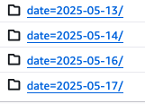
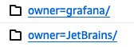
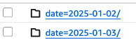
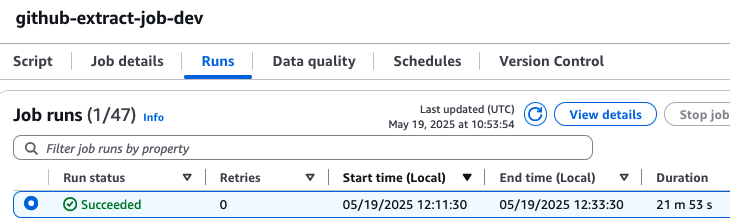
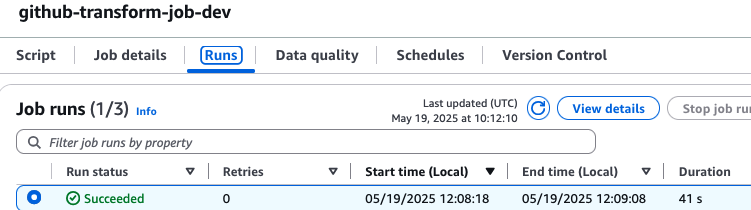
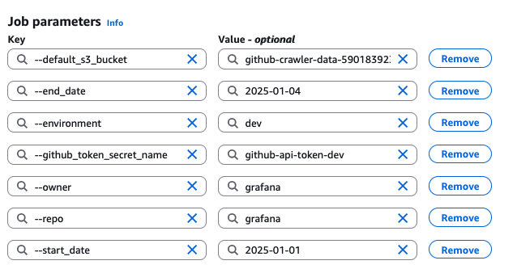

# GitHub Crawler

A tool for collecting commit data from GitHub repositories for training ML models.

## Overview

This project is designed to collect and process GitHub commit data for ML model training. It crawls repositories, extracts commit information, and stores it in a structured format optimized for ML training purposes.

## Data Schema

The processed data is stored in a flattened schema optimized for ML training. Each record represents a file change within a commit:

```json
{
    "commit_sha": str,
    "author_name": str,
    "message": str,
    "file_path": str,
    "status": str,
    "content_before": str,
    "content_after": str,
    "changes": int,
    "additions": int,
    "deletions": int,
    "file_type": str,
    "unified_diff": str,
    "directory_category": str,
    "change_complexity": float,
    "commit_overall_files_changed": int,
    "commit_overall_lines_changed": int
}
```

### Schema Details

- **Commit Metadata**
  - `commit_sha`: Unique identifier for the commit (str)
  - `author_name`: Name of the commit author (str)
  - `message`: Commit message (str)

- **File Metadata**
  - `file_path`: Path of the modified file (str)
  - `status`: Change status (added, modified, removed) (str)
  - `content_before`: File content before the commit (str)
  - `content_after`: File content after the commit (str)
  - `changes`: Total number of changes (int)
  - `additions`: Number of lines added (int)
  - `deletions`: Number of lines deleted (int)
  - `file_type`: File extension (str)
  - `unified_diff`: Unified diff format of changes (str)

- **ML Features**
  - `directory_category`: Category of the directory (str)
  - `change_complexity`: Complexity score of the change (float)
    - Higher score (closer to 1) means more complex change
    - Lower score (closer to 0) means simpler change
    - Calculated based on:
      - Number of change chunks
      - Mix of additions and deletions
      - Spread of changes across the file
  - `commit_overall_files_changed`: Total files changed in commit (int)
  - `commit_overall_lines_changed`: Total lines changed in commit (int)

The schema is validated and enforced during the transform step using the `validate_schema_transform` function, ensuring data type consistency before saving to Parquet format.

## Setup

This project uses a Python virtual environment to manage dependencies.

See [Virtual Environment Setup](VIRTUAL_ENV_SETUP.md) for instructions on how to set up and use the virtual environment.

### Prerequisites

- Python 3.9+
- AWS Account with appropriate permissions
- GitHub API token
- Terraform (for infrastructure deployment)

### Configuration

1. Set up AWS credentials
2. Configure GitHub API token in AWS Secrets Manager
3. Update Terraform variables as needed

### Deployment

1. Initialize Terraform:
```bash
cd IAC/terraform
terraform init
```

2. Apply infrastructure:
```bash
terraform apply
```

## Usage

The project provides two main ETL jobs:

1. **Extract Job**: Collects raw commit data from GitHub
2. **Transform Job**: Processes raw data into ML-optimized format

Jobs can be triggered manually or scheduled via AWS Glue.

## Progress and Limitations

### Successfully Collected Repositories
The following repositories have been successfully collected:
- JetBrains/MPS
- JetBrains/kotlin
- JetBrains/ideavim
- grafana/grafana

### Collection Parameters
- Date range: 2025-05-12 to 2025-05-19
- Maximum commits per date: 10
- Data stored in S3 bucket: github-crawler-data-590183923818

### Rate Limit Considerations
The GitHub API has strict rate limits that can be quickly reached:
- Standard rate limit: 5,000 requests per hour for personal access tokens
- Each commit collection requires multiple API calls:
  - One call to get commit details
  - Additional calls for each file in the commit
  - More calls for file content before/after changes
- The collector implements automatic rate limit handling:
  - Monitors remaining API calls
  - Pauses when rate limit is reached
  - Resumes after rate limit reset
  - Provides warnings when approaching limits

### Data Storage
Collected data is stored in S3 with the following structure:
```
s3://github-crawler-data-590183923818/datalake/raw/github/owner={owner}/repo={repo}/commits/date={date}/{commit_sha}.json
```

## GitHub Workflow

### Repository Structure
```
github-crawler/
├── src/
│ └── utils/
│ ├── github_collector_toolkit.py # Core GitHub data collection
│ ├── s3_toolkit.py # S3 storage operations
│ └── secrets_manger_toolkit.py # AWS Secrets Manager integration
├── tests/
│ └── test_github_collector_toolkit.py # Unit tests
└── etl-artifacts/
    └── glue_jobs/ # AWS Glue job definitions
        └── scripts/ # Python scripts for Glue jobs
            ├── github_extract_job.py
            └── github_transform_job.py
```

### Development Workflow
1. **Code Organization**
   - Core functionality in `src/utils/`
   - Tests in `tests/`
   - ETL jobs in `etl-artifacts/`

2. **Testing**
   - Unit tests for core functionality
   - Mock external dependencies (GitHub API, S3)
   - Test error handling and edge cases

3. **Error Handling**
   - Input validation
   - Graceful degradation
   - Detailed error logging
   - Rate limit management

4. **Data Processing**
   - Raw data collection from GitHub
   - Data transformation and enrichment
   - S3 storage in optimized format

### CI/CD Pipeline
The project uses GitHub Actions for continuous integration and deployment:

1. **Build and Upload Utils Package** (`.github/workflows/build-and-upload-utils.yml`)
   - Triggers on:
     - Changes to `src/utils/` directory
     - Changes to workflow file
     - Changes to `setup.py`
     - Manual trigger
   - Builds Python wheel package
   - Uploads to S3:
     - Wheel package to `s3://${S3_BUCKET}/etl-artifacts/code/`
     - ETL scripts to `s3://${S3_BUCKET}/etl-artifacts/code/`
   - Uses AWS credentials for S3 upload
   - Runs on Ubuntu latest with Python 3.9

## Scaling Considerations

### AWS Glue Job Concurrency

1. **Job-Level Settings**
   - Maximum concurrency: Controls parallel job instances
   - Default: 1 concurrent run
   - Configurable up to 50 concurrent runs per job
   - Additional invocations are queued

2. **Account-Level Limits**
   - Default: 10 concurrent jobs across all Glue jobs
   - Applies per AWS account and region
   - Quota increases available through AWS Service Quotas Console

3. **Resource Constraints**
   - Limited by available DPUs (Data Processing Units)
   - Jobs may queue if insufficient DPUs
   - Automatic resource management

## Implementation Roadmap

1. **Phase 1: Core Infrastructure**
   - Set up S3 storage buckets
   - Implement data schema
   - Create GitHub API integration

2. **Phase 2: Data Collection**
   - Implement repository selection
   - Build commit extraction pipeline
   - Develop file content storage

3. **Phase 3: Scaling and Optimization**
   - Implement distributed processing
   - Add incremental updates
   - Optimize storage usage

4. **Phase 4: Advanced Features**
   - Add filtering capabilities
   - Implement repository state reconstruction
   - Develop analytics features

## Examples

#### S3 Data Structure Examples

<b>Raw data in S3 for JetBrains/MPS</b>
<p>
  
  &nbsp;&nbsp;<br>
  
</p>

<b>Raw data in S3 for multiple owners</b>
<p>
    
</p>

<b>Processed data in S3 for grafana/grafana</b>
<p>

 &nbsp;&nbsp; &nbsp;&nbsp;<br>
  
<br>
  
</p>

#### Glue jobs Examples

<p>
  
  &nbsp;&nbsp; &nbsp;&nbsp;<br><br><br>
  
  &nbsp;&nbsp; &nbsp;&nbsp;<br><br><br>
  
</p>
