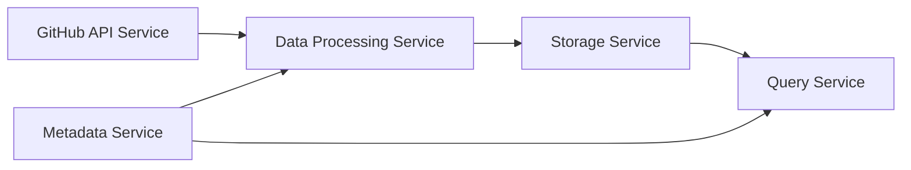

# GitHub Crawler

A tool for collecting commit data from GitHub repositories for training ML models.

## Architecture

## Setup

This project uses a Python virtual environment to manage dependencies.

See [Virtual Environment Setup](VIRTUAL_ENV_SETUP.md) for instructions on how to set up and use the virtual environment.
